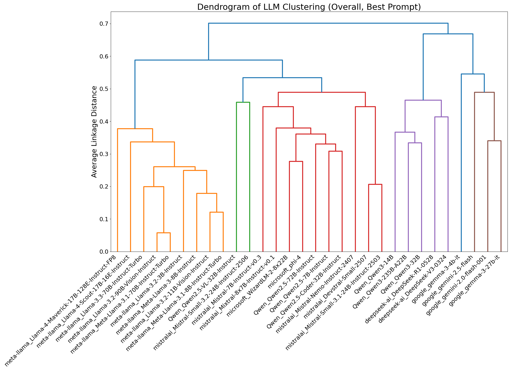

# LLM Response Classifier

This repository contains code for building and evaluating a classifier that identifies 
unknown Large Language Models (LLMs) based on their responses to specific user prompts. 
The classifier compares responses from an unknown LLM against a library of known LLMs 
using techniques like word frequency vectors (e.g., TF-IDF) or embedding vectors. 
It supports abstention (predicting "unknown") via thresholding (on the cosine similarity 
value) for out-of-distribution detection.

The project progresses through phases:
1. **Base Dataset Collection and Model Selection**: Collect responses for user prompts at varying temperatures and compare classifiers using cross validation.
2. **System Prompt Robustness Evaluation**: Test classifiers and system prompt neutralization techniques against system prompts.
3. **Final Classifier with Threshold Tuning**: Use a refined dataset to tune and evaluate a production-ready classifier with OOD detection.

Key findings:
- **Best classifier**: TF-IDF trigram with cosine similarity (achieves >95% top-1 accuracy on base data).
- **Best user prompt**: "Invent a new taste unknown to humans ... Speak like a professor and only ..." (most discriminative).
- **Optimal threshold**: 0.65 (balances accuracy and OOD detection; see tuning results below).
- **Refusal Analysis**: Overall refusal rate 10.83%. Highest in legal/tech support prompts. Meta and Google models refuse more (up to 36%).
- **Inter-LLM Similarities**: LLMs from the same family (e.g., Meta's Llama models) show high cosine similarities. Distinct clusters emerge, with Meta and Google models forming their own groups, and others more dispersed.
- **Intra-LLM Dispersion**: Dispersion decreases with higher temperatures, indicating more consistent responses. For example, Qwen_Qwen3-14B has the lowest overall dispersion (mean cosine to centroid: 0.448).
- **Classifier Performance**: Using TF-IDF trigram with cosine similarity, top-1 accuracy on non-held-out test set is 0.92 (identified), with 30% unknown rate. On held-out, family accuracy is 1.0, branch accuracy is 0.33 at threshold 0.65.
- **System Prompt Robustness**: Prompt injection techniques and other system prompt neutralization technique does not improve prediction accuracy.

## Repository Structure

```
.
├── classifier_model_scripts/     # Core scripts for data processing, splitting, evaluation, and analysis
├── configs/                      # Configuration files (e.g., set of LLMs, user prompts, etc)
├── data/                         # Raw and processed datasets, splits
├── data_collection_scripts/      # Scripts for collecting LLM response data
├── README.md                     # This file
└── results/                      # Output reports, plots, and metrics
```

## Setup and Installation

### Prerequisites
- Conda must be installed on your machine
- DeepInfra API Key: Create a file named `.env` in the root of response_classifier with the content `DEEPINFRA_API_KEY=your_key_here`.

### Environment Setup
1. Clone the repo: 
```bash
git clone git@github.com:CSC392-CSC492-Building-AI-ML-systems/ai-identities.git
```
2. Move to the response_classifier folder:
```commandline
cd ai-identifies/response_classifier
```
3. Create conda environment: 
```commandline
conda create --name llm_detector python
```
4. Activate conda environment:
```commandline
conda activate llm_detector
```
5. Install dependencies from conda: 
```commandline
conda install openai tqdm scikit-learn pandas numpy matplotlib seaborn pyyaml scipy tabulate python-dotenv
```
6. Install dependencies from pip:
```commandline
pip install sentence-transformer
```

## Data Collection

Data is collected using DeepInfra API for combinations of LLMs, prompts, system prompts, and temperatures. 
Scripts use bash wrappers for convenience. Note that some LLMs on Deepinfra requires pre-payment to use it. 
Hence, we suggest adding funds to your Deepinfra account before starting data collection. 


### Base Dataset
- Collects responses for (LLM, user prompt, temperature bin).
- Modify bash script permission (in response_classifier/): `chmod +x data_collection_scripts/collect_model_selection_data.bash`
- Run: `./data_collection_scripts/collect_model_selection_data.bash`
- Output: saved to `data/base_dataset_raw_data/` (stores JSON file per LLM)
- Validate dataset: `python data_collection_scripts/validate_dataset.py --dataset-type base` (report saved to `data/base_dataset_sanity_report.txt`)

### System Prompt Dataset
- Collects for (LLM, user prompt, system prompt, neutralization technique, temperature bin)
  - The data collection script here uses 'configs/system_prompt_set.json'
- Modify bash script permission (in response_classifier/): `chmod +x data_collection_scripts/collect_system_prompt_data.bash`
- Run: `./data_collection_scripts/collect_system_prompt_data.bash`
- Output: saved to `data/system_prompt_dataset_raw_data/`
- Validate dataset: `python data_collection_scripts/validate_dataset.py --dataset-type system_prompt` (report saved to `data/system_prompt_dataset_sanity_report.txt`)

### Final CLF Dataset
- Collects for (LLM, best user prompt, system prompt, temperature bin). No neutralization
- Note that the system prompt set used here is different from the one used for the System prompt dataset above
  - The data collection script here uses 'configs/final_clf_system_prompt_set.json'
- Modify bash script permission (in response_classifier/): `chmod +x data_collection_scripts/collect_final_clf_dataset.bash`
- Run: `./data_collection_scripts/collect_final_clf_dataset.bash`
- Output: saved to `data/final_clf_dataset_raw_data/`
- Validate dataset: `python data_collection_scripts/validate_dataset.py --dataset-type final_clf` (report saved to `data/final_clf_dataset_sanity_report.txt`)


## Experiments

### 1. Base Dataset and 5-fold Cross Validation
- **Goal**: Select best classifier method (word freq vs. embeddings) via 5-fold CV on base dataset.
- **Dataset**: The base dataset (stored in `data/base_dataset_raw_data`)
- **Steps**:
  1. Split data: `python classifier_model_scripts/main_experiment.py --action split_data`.
  2. Validate splits: `python classifier_model_scripts/main_experiment.py --action validate_splits`. This splits the entire dataset (by the LLMs) 
     into non-held-out set and held-out set which does not share any LLM. The non-held-out set is then split into train and test sets using the 5:1 split ratio. 
  3. Run 5-fold CV on the train set for a classifier method: `python classifier_model_scripts/main_experiment.py --action cross_validation --method tfidf_trigram --eval_both`. 
     The method name should be one of the 'name' entries in 'configs/classification_methods_config.yaml' file. 
- **Library**: The 4 train splits of the train set.
- **Test Set**: The remaining 1 val split of the train set.
- **Output**: Metrics saved to `results/cv_metrics.txt`.
- **Results**: All methods achieved >95% top-1 accuracy. LLM identification on responses that are not under
               the influence of system prompts is very easy. This motivated the collection of the system prompt 
               dataset which makes it much harder to identify LLMs by using very strong system prompts. 

**CV Metrics Table** (Averaged across folds; from `results/cv_metrics.txt`):

| Method                      | Top-1 Acc | Top-3 Acc |
|-----------------------------|-----------|-----------|
| raw_freq_unigram_cosine     | 0.959     | 0.998     | 
| raw_freq_unigram_euclidean  | 0.959     | 0.998     | 
| tfidf_unigram_cosine                        | 0.960     | 1.0       | 
| tfidf_unigram_euclidean                        | 0.960     | 1.0       |
| tfidf_trigram_cosine                        | 0.968     | 1.0       | 
| tfidf_trigram_euclidean                        | 0.968     | 1.0       |
| potion_emb_cosine                        | 0.962     | 0.998     | 
| potion_emb_euclidean                        | 0.962     | 0.999     |

For more information, check `results/cv_metrics.txt`. 

### 2. System Prompt Robustness
- **Goal**: Compare and evaluate classifiers methods on LLM response data under the 
            influence of system prompts. Additionally, compare and determine the most discriminative 
            base user prompt and the most effective system prompt neutralization technique. 
- **Library**: The entire train set of the base dataset.
- **Test Set**: The entire system prompt dataset.
- **Run**: `python classifier_model_scripts/run_sys_prompt_experiment.py --eval-both-metrics`.
- **Output**: Report in `results/system_prompt_experiment_report.txt`.
- **Results**: Neutralization "none" is best; "Invent a new taste unknown to humans ... Speak 
  like a professor and only ..." is the best user prompt.


**Average Neutralization Technique Effectiveness Across All Classifiers** (from `results/system_prompt_experiment_report.txt`):

| Technique                   | Avg Accuracy |
|-----------------------------|--------------|
| none                        | 0.32         |
| response styles             | 0.25         |
| localization                | 0.25         |
| linguistic uniqueness       | 0.22         |
| best-of-n text augmentation | 0.11         |

- **none**: Applies no system prompt neutralization technique to the base user prompts.
- **response styles**: Prepends a short text to base user prompts. The text asks for response in 3 distinct styles.
- **localization**: Prepends a short text to base user prompts. The text asks for a standard response and a response 
                    that uses linguistic patterns common in some specific countries. 
- **linguistic uniqueness**: Prepends a short text to base user prompts. The text asks the LLM to prioritize its linguistic uniqueness. 
- **best-of-n text augmentation**: Applies the best-of-n text augmentation technique to the base user prompts. The technique randomly capitalizes and swaps characters.

### 3. Refusal Response Analysis on the Final CLF Dataset
- Our final/selected classifier method uses a single user prompt (the best user prompt) to get response 
  data from the unknown LLMs. Then, it uses these data to make predictions. Having a 
  better understanding of which LLMs and system prompts results in the most refusal is 
  crucial for improving the classifier further and making it even more effective. 
- Since refusal responses can have very similar style and length regardless of the LLM, 
  they make it difficult to identify the LLM that generated the response. Additionally, since 
  the library contains data from known LLMs which were collected without using system 
  prompts, the classifier can struggle to make predictions as the refusal 
  response will likely have very low cosine similarity values with most or all of the 
  LLMs in the library. 
- We used a heuristic approach (short responses or responses that contains certain 
  refusal keywords such as "cannot", "unable", etc) to categorize LLM responses into refusal and 
  non-refusal responses. This is the most straightforward approach. However, it can
  overestimate the percentage of refusal responses. When we used no system prompt, we still
  got approximately 5% refusal response rate which is around 0% in reality. This heuristic
  approach is not perfect, but it is the most straightforward approach and still effective 
  to get a rough estimate.
- **Run**: `python classifier_model_scripts/analyze_final_clf_dataset_refusal.py`.
- **Output**: saved to `results/final_clf_dataset_analysis/final_clf_refusal_analysis.txt`.
- **Results**: Overall refusal rate ~10%; varies by LLM/family.


### 4. Final Classifier with Threshold Tuning
- **Goal**: Search for the optimal threshold value, which will be used to make predictions or predict 
            "unknown", on the 2 tuning sets. The optimal threshold should maximize the identification accuracy of 
            the predicted LLMs while also maximizing the OOD (out of distribution) accuracy. 
            Then, evaluate the final classifier on 2 test sets using the selected threshold value.
- **Threshold Value**: When the classifier is making prediction, it uses the cosine similarity 
  scores to rank the known LLMs in the library/catalogue. If the highest cosine similarity value is
  greater than or equal to the threshold, the classifier actually makes prediction. On the other 
  hand, if the highest cosine similarity value is less than the threshold, the classifier will 
  then not make any predictions (or predict "unknown" equivalently).
- **Dataset**: The final CLF dataset (stored in `data/final_clf_dataset_raw_data`)
- **Steps**:
  1. Split data: `python classifier_model_scripts/run_final_clf_experiment.py --action split`. The final CLF dataset is split into 
     non-held-out (contains data for 30 LLMs) and held-out set (contains data for 6 LLMs). Then, split both sets in half while 
     stratifying by (LLM, best user prompt, system prompt, temperature bin) to get a tuning and test set for each. Hence, we 
     get non-held-out tuning set, held-out tuning set, non-held-out test set, held-out test set. The 4 splits are saved to 
     `data/splits/final_clf/` as pickle files.
  2. Validate collected data: `python classifier_model_scripts/run_final_clf_experiment.py --action validate_splits`.
  3. Search for optimal threshold: `python classifier_model_scripts/run_final_clf_experiment.py --action tune`.
  4. Evaluate classifier on the 2 test sets: `python classifier_model_scripts/run_final_clf_experiment.py --action evaluate --threshold 0.65`.
- **Output**: Reports/plots saved to `results/final_clf_tuning/` and `results/final_clf_test/`.
- **Results**: Optimal threshold ~0.65. High in-distribution accuracy with good OOD detection accuracy.

#### Tuning Metrics


For more plots and detailed report, check `results/final_clf_tuning/`.
The following are the potentially confusing keywords in `results/final_clf_tuning/final_clf_tuning_report.txt`:
- Overall table: contains metrics for all the data points.
- Refusal table: contains metrics for data points that were detected to be refusal responses.
- Non-refusal table: contains metrics for data points that were detected to be non-refusal responses.
- All column/metric names ending with `identified` are metrics computed from data points for which our classifier actually makes prediction
- All column/metric names ending with `all` are metrics computed from all data points (both predicted data points and "unknown" data points)
- `unknown_rate`: the percentage of data points for which the classifier does not make any predictions (i.e., predicts "unknown")
- `misidentification_rate`: the value `1 - unknown_rate` 
- `identified_error_rate`: the value `1 - top1_accuracy_identified`

Note that we used a heuristic approach (short responses or responses that contains certain 
refusal keywords such as "cannot", "unable", etc) to categorize LLM responses in refusal 
responses (LLMs refused to answer the user prompt) and non-refusal responses. The heuristic
approach for refusal response categorization is not perfect, but it is the most straightforward 
approach and still quite effective to get a rough estimate.


#### Test Metrics (Using Threshold Value 0.65) (from `results/final_clf_test/final_clf_test_report.txt`):

The following points be confusing in `results/final_clf_tuning/final_clf_test_report.txt`:
- The metric names ending in "all" or "identified" depends on whether we predicted "unknown"
  for the LLM or not. Thus, the LLM family and branch predictions does not directly depend
  on the threshold value and whether we predicted "unknown" or not.
- However, if a metric name has "identified", it still means that the metric is computed
  from identified data points.

##### Non-Held-Out Metrics

| Metric                     | overall | refusal | non\_refusal |
| -------------------------- | ------- | ------- | ------------ |
| top1\_accuracy\_all        | 0.6378  | 0.0357  | 0.6777       |
| top3\_accuracy\_all        | 0.6822  | 0.0357  | 0.7251       |
| top1\_accuracy\_identified | 0.9199  | 1       | 0.9196       |
| top3\_accuracy\_identified | 0.984   | 1       | 0.9839       |
| f1\_score\_identified      | 0.9047  | 1       | 0.9047       |
| precision\_identified      | 0.9433  | 1       | 0.9433       |
| recall\_identified         | 0.906   | 1       | 0.906        |
| unknown\_rate              | 0.3067  | 0.9643  | 0.263        |
| misidentification\_rate    | 0.0556  | 0       | 0.0592       |
| identified\_error\_rate    | 0.0801  | 0       | 0.0804       |
| total\_predictions         | 450     | 28      | 422          |
| total\_identified          | 312     | 1       | 311          |

##### Held-Out Metrics

| Metric                             | overall | refusal | non\_refusal |
| ---------------------------------- | ------- | ------- | ------------ |
| top1\_family\_accuracy\_identified | 1       | 0       | 1            |
| top3\_family\_accuracy\_identified | 1       | 0       | 1            |
| top1\_branch\_accuracy\_identified | 0.3333  | 0       | 0.3333       |
| top3\_branch\_accuracy\_identified | 0.4444  | 0       | 0.4444       |
| top1\_family\_accuracy\_all        | 0.9556  | 0.6     | 0.9765       |
| top3\_family\_accuracy\_all        | 0.9667  | 0.6     | 0.9882       |
| top1\_branch\_accuracy\_all        | 0.4667  | 0.4     | 0.4706       |
| top3\_branch\_accuracy\_all        | 0.6444  | 0.4     | 0.6588       |
| ood\_detection\_accuracy           | 0.8     | 1       | 0.7882       |
| misidentification\_rate            | 0.2     | 0       | 0.2118       |
| total\_predictions                 | 90      | 5       | 85           |
| total\_identified                  | 18      | 0       | 18           |

For confusion matrix plots and a more detailed report, check `results/final_clf_test/`.


## Library Analysis
- The analysis of the library data (train set of the base dataset) can reveal some 
  patterns and relationships (e.g., similarity) between the LLMs in the library.
- **Run**: `python classifier_model_scripts/analyze_llm_relationships.py`.
- **Output**: Metrics/plots saved to `results/library_data_analysis/`.

### Inter-LLM Cosine Similarity Heatmap
- A heatmap (matrix) that represents the pairwise cosine similarity values for each combination of LLMs in the library.
- It can be observed that there are lighter colored blocks (more green and yellow) along the diagonal, suggesting 
  that LLMs mostly have the most similar responses to other LLMs in the same family.


Insights from the Cosine Similarity Heatmap Above:
- A brighter color (more green and yellow) indicates more similarity.
- LLM labels for both axes have the same order.
- The heatmap has square blocks of lighter color along the diagonal. This implies that LLMs are 
  generally the most similar to other LLMs in the same family.


### Dendrogram of LLM Clustering
- Dendrogram is a type of diagram used to illustrate the arrangement of clusters produced by 
  hierarchical clustering. These hierarchical clustering algorithms start with each item as its 
  own cluster and progressively merge the most similar ones until everything is in a single cluster.
- **Structure**:
  - **Leaves (Bottom)**: These are the individual items being clustered (e.g., LLMs in the plot below).
  - **Y-Axis**: Quantifies dissimilarity. Lower values indicate closer (more similar) items/LLMs. In 
    our case, we used 1 - cosine similarity as the dissimilarity metric. 
  - **X-Axis**: Lists the items/LLMs, often reordered to group similar ones together.
  - **Branches**: Horizontal lines connect items or clusters. The height of a branch (y-axis) 
    represents the "distance" or dissimilarity between the merged clusters. Shorter branches 
    mean more similarity; taller ones mean less.
  - **Colors**: Sometimes added to highlight distinct clusters (e.g., by cutting the tree at a certain height).



Insights from the Dendrogram Above:
- Orange Cluster: Meta's Llama models clusters closely here, showing family-level similarity.
- Green Cluster: A pair of Qwen and Mistral model clusters here.  
- Red Cluster: Two Microsoft models cluster closely, three Qwen2.5 models cluster closely, and
  the remaining Mistral models all clusters. Then, these three clusters merges to create a larger cluster.
- Purple Cluster: The three Qwen3 models clusters and the two Deepseek models clusters. Then, they merge to 
  create a larger cluster.
- Brown Cluster: The three Google models clusters here. 
- Note that "google_gemma-3-4b-it" does not cluster closely with any other model or group of models.
- Family Clustering: Models from the same family (e.g., all Llama variants) generally cluster 
  closely, reflecting shared architectures or training data. This validates the project's inter-LLM similarity findings.
- Dissimilarity within Family: Qwen models are spread widely across many different branches (green, red, and 
  purple branches) unlike most of the LLM families.

For more plots and detailed reports, check `results/library_data_analysis/`.